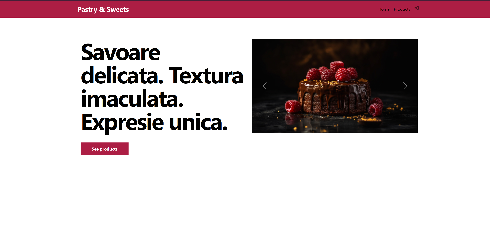

# <span style="color:orange;">Sweet Market Place</span>

**SweetMarketPlace** este o aplicație web dezvoltată cu **Django**, destinată să faciliteze cumpărarea și vânzarea de produse dulci și de cofetărie. Proiectul utilizează **Python** și **Django** pentru back-end și **HTML** și **CSS** pentru front-end, oferind o experiență de utilizare plăcută și vizuală. Baza de date este gestionată folosind **SQLite3**.

## <span style="color:orange;">Caracteristici</span>

- **Interfață intuitivă**: Design atrăgător realizat cu HTML și CSS care permite utilizatorilor să exploreze produsele de cofetărie într-un mod ușor și plăcut.
- **Imagini de produs**: Fiecare produs este însoțit de imagini de înaltă calitate pentru o prezentare vizuală clară.
- **Descrierea produselor**: Fiecare produs include o descriere detaliată, oferind informații despre ingrediente, dimensiuni și alte detalii relevante.
- **Panou de administrare**: Django Admin oferă funcționalități pentru gestionarea eficientă a produselor și a utilizatorilor de către administratorii platformei.
- **Login/Logout - Register**: Utilizatorii au opțiunea de a se autentifica, a se deconecta și a se înregistra.


## <span style="color:orange;">1. Screenshot Sweet Market Place</span>



## <span style="color:orange;">2. Tehnologii si tooluri utilizate</span>

* **Python** - limbaj de programare
* **Django** - Framework web
* **Pycharm** - IDE
* **SqliLiteStudio** si libraria **SqlLite3** - baze de date
* **HTML, CSS** - Creare pagini web si sitilizarea acestora


## <span style="color:orange;">Instalare</span>

1. Clonați repo-ul:
   ```bash
   git clone https://github.com/poprobert0412/SweetMarketPlace.git
   ```
2. Navigați în directorul proiectului:
   ```bash
   cd SweetMarketPlace
   ```
3. Creați un mediu virtual și activați-l:
   ```bash
   python -m venv venv
   source venv\Scripts\activate  # Pe Mac: venv\Scripts\activate
   ```
4. Instalați dependențele:
   ```bash
   pip install -r requirements.txt
   ```
5. Rulați migrațiile bazei de date pentru a configura schema SQLite3:
   ```bash
   python manage.py migrate
   ```
6. Porniți serverul de dezvoltare:
   ```bash
   python manage.py runserver
   ```
7. Acceseaza aplicatia intr-un browser folosind link ul urmator:
   * http://127.0.0.1:8000

## <span style="color:orange;">Contribuții</span>
Contribuțiile sunt binevenite! Pentru a contribui, deschideți o problemă sau trimiteți un pull request.